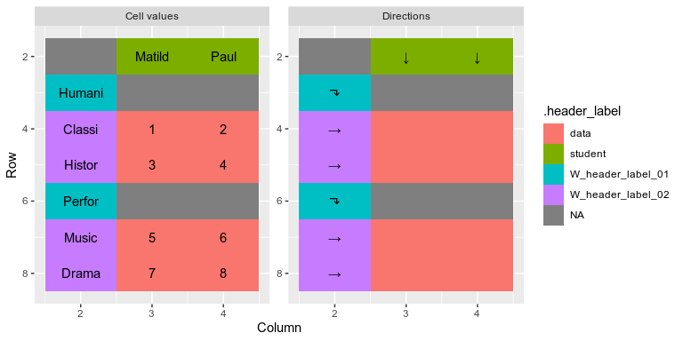
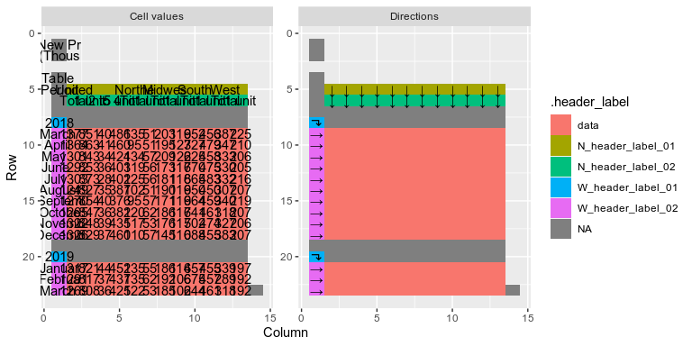

<!-- badges: start -->
[](https://travis-ci.org/ianmoran11/locatr)
[](https://codecov.io/gh/ianmoran11/locatr?branch=master)
<!-- badges: end -->

<!-- README.md is generated from README.Rmd. Please edit that file -->
Overview
--------

The `locatr` package makes tidying data from spreadsheets easier. It helps identify and classify table cells, and then visually inspect them. .

Installation
------------

The `locatr` package is not available on CRAN. It can be installed from github with the following script:

``` r
# install.packages("devtools")
devtools::install_github("ianmoran11/locatr")
```

Usage
-----

The locate functions work much like `unpivotr::behead.` The key difference is that, rather than progressively removing headers, locate functions annotate the tidyxl data frame with .direction, .header\_group and .value columns, leaving reshaping to a final function call.

### Minimal example : `locate`

Here's a minimal example involving a table with two row headers and two column headers.


The first step is to locate the data cells with the `locate_data` function. Calling `locate_data` and providing an expression that filters for data cells sends these cells to an attribute named `data_cells`.

``` r
locatr_example("worked-examples.xlsx") %>% 
  xlsx_cells_fmt(sheets = "pivot-example") %>%
  locate_data(data_type == "numeric") %>% 
  attr("data_cells")
#> # A tibble: 16 x 24
#>    .value .direction .header_label address   row   col data_type character
#>    <chr>  <chr>      <chr>         <chr>   <int> <int> <chr>     <chr>    
#>  1 1      <NA>       <NA>          D4          4     4 numeric   <NA>     
#>  2 2      <NA>       <NA>          E4          4     5 numeric   <NA>     
#>  3 3      <NA>       <NA>          F4          4     6 numeric   <NA>     
#>  4 0      <NA>       <NA>          G4          4     7 numeric   <NA>     
#>  5 3      <NA>       <NA>          D5          5     4 numeric   <NA>     
#>  6 4      <NA>       <NA>          E5          5     5 numeric   <NA>     
#>  7 5      <NA>       <NA>          F5          5     6 numeric   <NA>     
#>  8 1      <NA>       <NA>          G5          5     7 numeric   <NA>     
#>  9 5      <NA>       <NA>          D6          6     4 numeric   <NA>     
#> 10 6      <NA>       <NA>          E6          6     5 numeric   <NA>     
#> 11 9      <NA>       <NA>          F6          6     6 numeric   <NA>     
#> 12 2      <NA>       <NA>          G6          6     7 numeric   <NA>     
#> 13 7      <NA>       <NA>          D7          7     4 numeric   <NA>     
#> 14 8      <NA>       <NA>          E7          7     5 numeric   <NA>     
#> 15 12     <NA>       <NA>          F7          7     6 numeric   <NA>     
#> 16 3      <NA>       <NA>          G7          7     7 numeric   <NA>     
#> # … with 16 more variables: numeric <dbl>, date <dttm>, logical <lgl>,
#> #   error <chr>, is_blank <lgl>, local_format_id <int>, sheet <chr>,
#> #   character_formatted <list>, formula <chr>, is_array <lgl>,
#> #   formula_ref <chr>, formula_group <int>, comment <chr>, height <dbl>,
#> #   width <dbl>, style_format <chr>
```

`plot_cells` produces a plot that indicates which cells are now labelled as data.

``` r
locatr_example("worked-examples.xlsx") %>% 
  xlsx_cells_fmt(sheets = "pivot-example") %>%
  locate_data(data_type == "numeric") %>% 
  plot_cells()
```


Once the data cells are identified, we can add header information to the tidyxl data frame (including .direction, .header\_group and .value columns) using the `locate` function. This function requires direction and variable names. Again, `plot_cells` can be called to check that data cells have been identified correctly.

Once all header have directions and names, `migrate` reshapes the tidyxl data frame into a tidy structure.

The gif below illustrate how direction informations is progressively added to the data frame.


And below is the code used in the gif.

``` r
locatr::locatr_example("worked-examples.xlsx") %>%
  xlsx_cells_fmt(sheets = "pivot-example") %>%
  locate_data(data_type == "numeric") %>% 
  locate(direction = "WNW", name = subject_type) %>% 
  locate(direction = "W", name = subject) %>% 
  locate(direction = "NNW", name = gender) %>% 
  locate(direction = "N", name = name) %>% 
  migrate()
#> # A tibble: 16 x 7
#>      row   col .value gender name    subject_type subject 
#>    <int> <int> <chr>  <chr>  <chr>   <chr>        <chr>   
#>  1     4     4 1      Year 1 Matilda Humanities   Classics
#>  2     4     5 2      Year 1 Paul    Humanities   Classics
#>  3     5     4 3      Year 1 Matilda Humanities   History 
#>  4     5     5 4      Year 1 Paul    Humanities   History 
#>  5     6     4 5      Year 1 Matilda Performance  Music   
#>  6     6     5 6      Year 1 Paul    Performance  Music   
#>  7     7     4 7      Year 1 Matilda Performance  Drama   
#>  8     7     5 8      Year 1 Paul    Performance  Drama   
#>  9     4     6 3      Year 2 Matilda Humanities   Classics
#> 10     4     7 0      Year 2 Paul    Humanities   Classics
#> 11     5     6 5      Year 2 Matilda Humanities   History 
#> 12     5     7 1      Year 2 Paul    Humanities   History 
#> 13     6     6 9      Year 2 Matilda Performance  Music   
#> 14     6     7 2      Year 2 Paul    Performance  Music   
#> 15     7     6 12     Year 2 Matilda Performance  Drama   
#> 16     7     7 3      Year 2 Paul    Performance  Drama
```

### Conditional headers : `locate_if`

Sometimes not all headers in the same column or row belong to the same group. For example, in the table below, the row headers in column B represent a mix of subject type and subject name.


To deal with this we create a variable that represents the indenting of cells, and then use `locate_if` to selectively associate cells with directions and header groups.

``` r
locatr_example("worked-examples.xlsx") %>% 
  xlsx_cells_fmt(sheets = "pivot-indent") %>%
  append_fmt(fmt_alignment_indent) %>%
  locate_data(data_type == "numeric") %>%
  locate_if(fmt_alignment_indent == 0, direction = "WNW", name = subject_type) %>% 
  locate_if(fmt_alignment_indent == 1, direction = "W", name = subject) %>% 
  locate(direction = "N", name = student) %>% 
  migrate()
#> # A tibble: 8 x 6
#>     row   col .value student subject_type subject 
#>   <int> <int> <chr>  <chr>   <chr>        <chr>   
#> 1     4     3 1      Matilda Humanities   Classics
#> 2     4     4 2      Paul    Humanities   Classics
#> 3     5     3 3      Matilda Humanities   History 
#> 4     5     4 4      Paul    Humanities   History 
#> 5     7     3 5      Matilda Performance  Music   
#> 6     7     4 6      Paul    Performance  Music   
#> 7     8     3 7      Matilda Performance  Drama   
#> 8     8     4 8      Paul    Performance  Drama
```

### A more concise syntax : `locate_groups`

We can deal with multiple headers differentiated by formatting more concisely using `locate_groups`. The `.grouping` argument allows us to indicate which formats differentiate headers. In this case, hierarchy is indicated by indenting, which can be accessed with the `fmt_alignment_indent` function. The `.hook_if` argument receives an expression with `hook` that indicates which header\_groups are "WNW" rather than "N". The `.hook_if_rev` argument will switch directions from "N" to "WSW". Importantly the `hook` expression is passed into `summarise` so it needs to reduce columns to a single boolean value. This is the reason for using `any` in the example below.

``` r
locatr_example("worked-examples.xlsx") %>%
  xlsx_cells_fmt(sheets =  "pivot-indent") %>%
  append_fmt(fmt_alignment_indent) %>% 
  locate_data(data_type == "numeric") %>%
  locate_groups(direction = "W",
                .groupings = groupings(fmt_alignment_indent),
                .hook_if =     hook_if(any(fmt_alignment_indent == 0))) %>%
  locate(direction = "N", name = student) %>% 
  plot_cells()
```



To browse different aspects of formatting on which to separate headers, type `fmt_` and tab

A more complicated example: Tidying new residential construction data from the US Census Bureau
-----------------------------------------------------------------------------------------------

Here's a more complicate table.


We can tidy this table by:

-   filtering to include only the upper table (filtering out any cells below the first containing "RSE")
-   locating the data, preventing the inclusion of the cells containing 2018 and 2019 in column 1
-   differentiating row groups based on whether they are numeric cells
-   identifying column headers, using the `header_fill` argument to deal with merged cells.

``` r
annotated_df <- 
  locatr_example("newresconst.xlsx") %>% 
  xlsx_cells_fmt(sheets = "Table 1 - Permits") %>%
  append_fmt(fmt_font_bold) %>% 
  filter(row < min(row[str_detect(character,"RSE")],na.rm = TRUE)) %>% 
  locate_data(data_type == "numeric" & col > 1) %>%
  locate_groups(direction = "W", 
                .groupings = groupings(is.na(numeric)), 
                .hook_if = hook_if(any(data_type == "numeric"))) %>% 
  locate_groups(direction = "N", header_fill = "style")  

annotated_df %>% plot_cells()
```



``` r

annotated_df %>% migrate()
#> # A tibble: 156 x 7
#>      row   col .value N_header_label_… N_header_label_… W_header_label_…
#>    <int> <int> <chr>  <chr>            <chr>            <chr>           
#>  1     9     2 1377   United States    "Total"          2018            
#>  2     9     3 851    United States    "1 unit"         2018            
#>  3     9     4 40     United States    "2 to 4 units"   2018            
#>  4     9     5 486    United States    "5 units\r\n or… 2018            
#>  5     9     6 135    Northeast        "Total"          2018            
#>  6     9     7 51     Northeast        "1 unit"         2018            
#>  7     9     8 203    Midwest          "Total"          2018            
#>  8     9     9 119    Midwest          "1 unit"         2018            
#>  9     9    10 652    South            "Total"          2018            
#> 10     9    11 456    South            "1 unit"         2018            
#> # … with 146 more rows, and 1 more variable: W_header_label_02 <chr>
```

*Note that older versions of dplyr require substituting `filter` for `filter_fmt`.*
